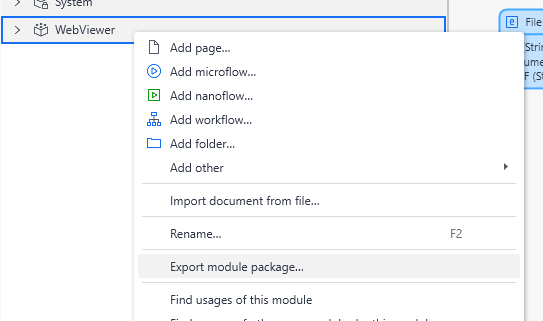
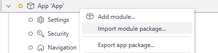

# WebViewer - Mendix Web Module

[WebViewer](https://docs.apryse.com/web/guides/get-started) is a powerful JavaScript-based PDF Library that is part of the [Apryse SDK](https://apryse.com/). It provides a slick out-of-the-box responsive UI that enables you to view, annotate and manipulate PDFs and other document types inside any web project.

- [WebViewer Documentation](https://docs.apryse.com/web/guides/get-started)
- [WebViewer Demo](https://showcase.apryse.com/)

This sample provides a backend module that facilitates server side operations that work with WebViewer.

## Get your trial key

A license key is required to run WebViewer. You can obtain a trial key in our [get started guides](https://docs.apryse.com/web/guides/get-started), or by signing-up on our [developer portal](https://dev.apryse.com/).

## install

```
git clone --depth=1 https://github.com/ApryseSDK/webviewer-samples.git
cd webviewer-samples/webviewer-mendix-module
npm install
```

## Features

- Updating documents after annotating
- Exporting/importing XFDF
- Real-time collaboration

## Installation

1. Download the module package from the marketplace or export the package manually (steps below).
2. Right click on your app package in Mendix Studio and import a module package.
3. Find the module package to import it.

## Initial setup

Before you begin, make sure you have installed [Mendix Studio Pro](https://docs.mendix.com/howto/general/install).

## Exporting a module

To export your module, right click on the `WebViewer` module and click `Export module package`. Follow the prompts and you should be able to deselect all the dependencies (unless you have made it a dependency). Finally, save the `mpk` file that will be imported as a module package.



The `mpk` can then be imported and used in a WebViewer app.


