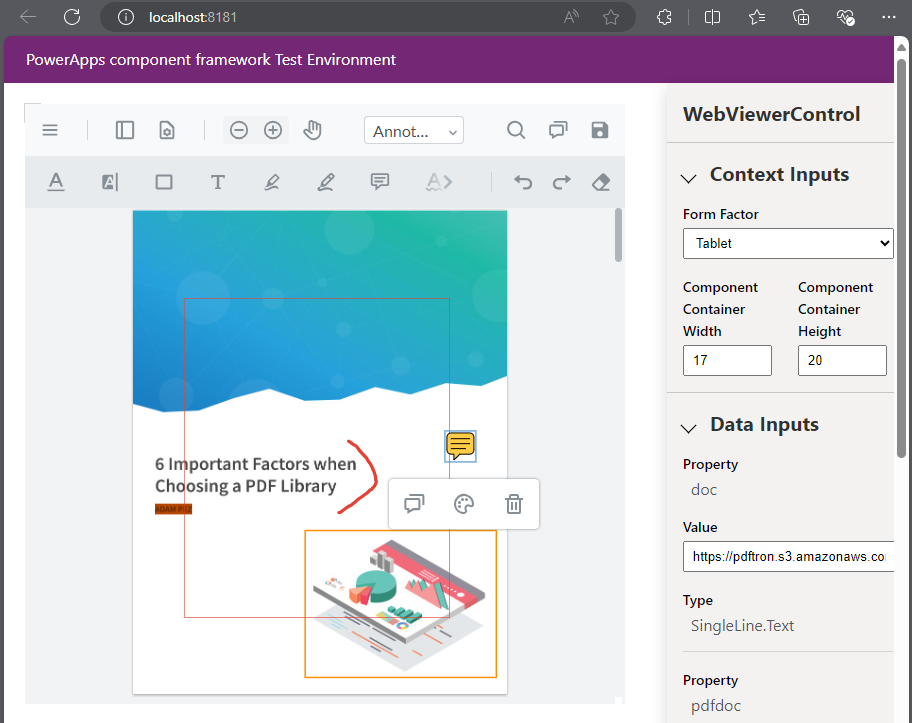

# WebViewer - Powerapps component sample

[WebViewer](https://docs.apryse.com/documentation/web/) is a powerful JavaScript-based PDF Library that is part of the [Apryse SDK](https://apryse.com/). It provides a slick out-of-the-box responsive UI that interacts with the core library to view, annotate and manipulate PDFs that can be embedded into web projects.


This repo is specifically designed for any users interested in integrating WebViewer into a [Powerapps](https://learn.microsoft.com/en-us/power-apps/maker/canvas-apps/create-component) component project.

## Demo

You can explore all of the functionality in our [showcase](https://showcase.apryse.com/).

## Initial setup

Before you begin, make sure your development environment includes:

1. [Node.js](https://nodejs.org/en). Note that WebViewer does not require NodeJS but it is used to help run this sample.
2. IDE used in this sample is Visual Studio Code with NPM commands within its terminal.
3. [GitHub command line](https://github.com/git-guides/install-git) `git`.

## Install

```
git clone https://github.com/ApryseSDK/webviewer-powerapps-component-sample.git
cd webviewer-powerapps-component-sample
npm install
```

## Run

```
npm start
```

After the app starts, you will be able to see WebViewer running on `localhost:8181` as a control within the PowerApps component framework test environment. This sample requires `localhost:3000` listening in the background. Hence the `npm start` in the `package.json` defines calls to both servers.




Visit Apryse's [WebViewer](https://docs.apryse.com/documentation/web/) page to see what else you can do with the WebViewer.

## WebViewer APIs

* [Webviewer API documentation](https://docs.apryse.com/api/web/WebViewerInstance.html)
* [webviewer-powerapps-component-sample](https://github.com/ApryseSDK/webviewer-powerapps-component-sample)

## Showcase

Refer to a running sample on Apryse SDK [showcase page](https://showcase.apryse.com/).

## Contributing

Any submission to this repo is governed by these [guidelines](/CONTRIBUTING.md).


## License

For licensing, refer to [License](LICENSE).
