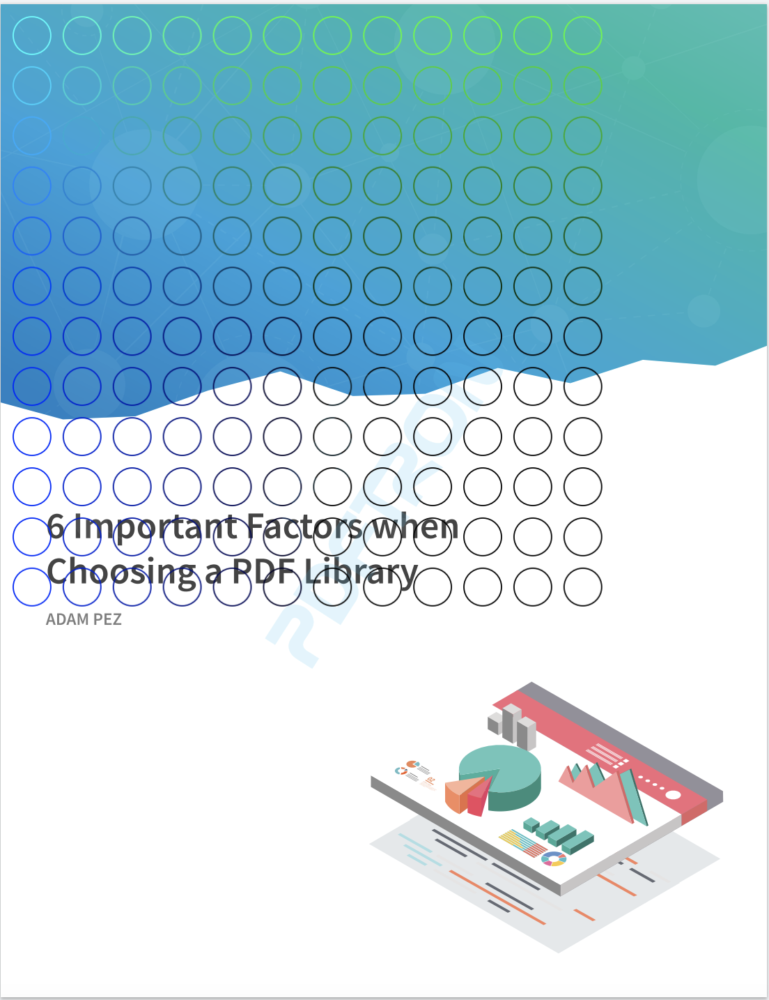
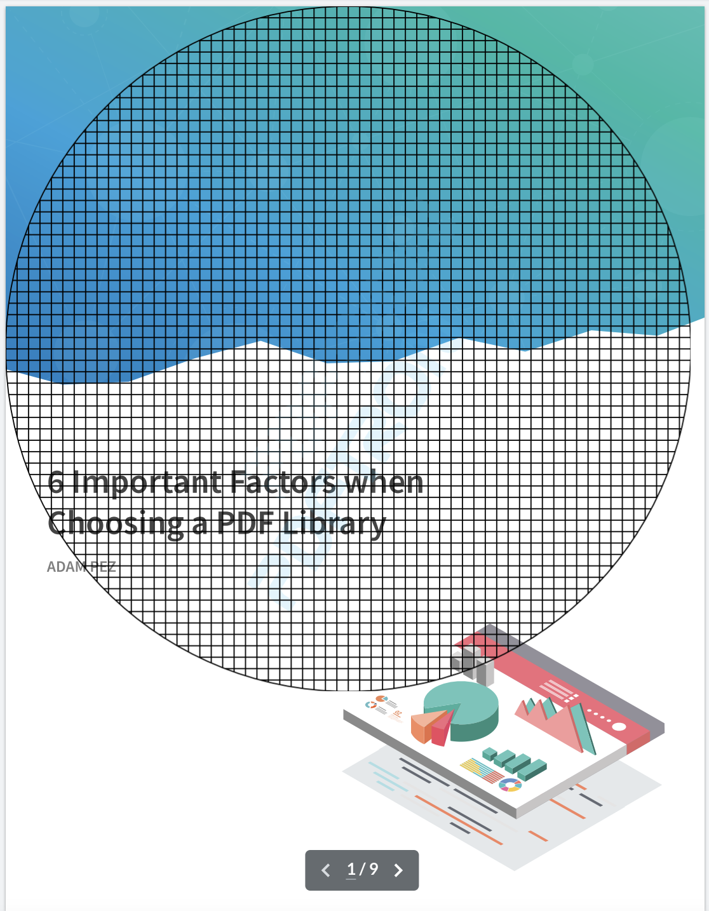
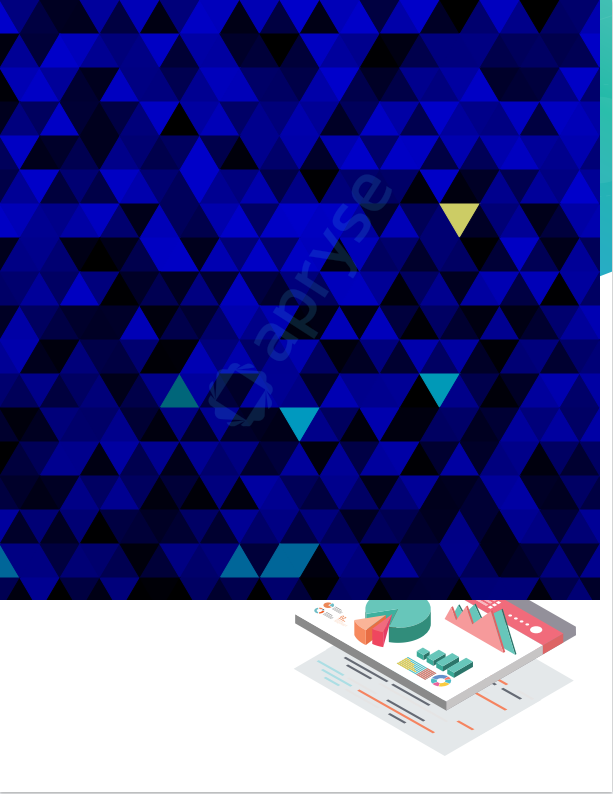
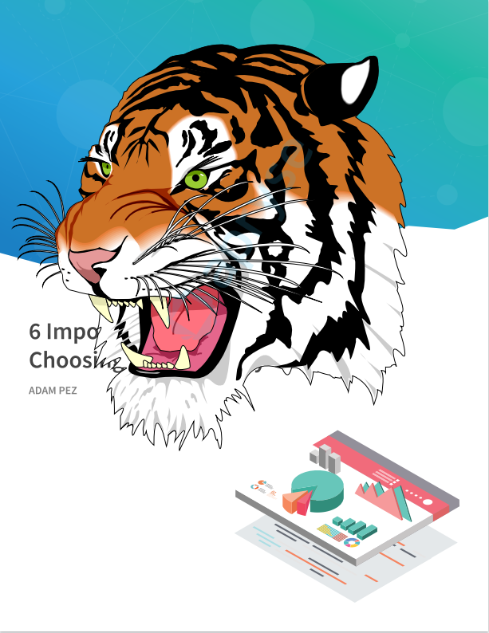

# WebViewer - React - CanvasToPDF sample

[WebViewer](https://docs.apryse.com/web/guides/get-started) is a powerful JavaScript-based PDF Library that is part of the [Apryse SDK](https://apryse.com/). It provides a slick out-of-the-box responsive UI that enables you to view, annotate and manipulate PDFs and other document types inside any web project.

- [WebViewer Documentation](https://docs.apryse.com/web/guides/get-started)
- [WebViewer Demo](https://showcase.apryse.com/)

CanvasToPDF is a PDF Library that allows users to create vector appearances with Canvas API. In other words, enable you to export your HTML Canvas to a vector quality PDF.

This sample is specifically designed for any users interested in integrating WebViewer and CanvasToPDF into React project.

## Get your trial key

A license key is required to run WebViewer. You can obtain a trial key in our [get started guides](https://docs.apryse.com/web/guides/get-started), or by signing-up on our [developer portal](https://dev.apryse.com/).

## Initial setup

Before you begin, make sure your development environment includes [Node.js](https://nodejs.org/en/).

## Install

```
git clone --depth=1 https://github.com/ApryseSDK/webviewer-samples.git
cd webviewer-samples/webviewer-react-canvasToPDF
npm install
```

## Run

```
npm start
```

After the app starts, you will be able to see WebViewer running on `localhost:3000`.

## Gradient Pattern Annotation
```js
const blob = await canvasToPDF(drawGradientCircles, {
  width: rectangleAnnot.Width,
  height: rectangleAnnot.Height,
});
```



## Hatch Annotation

You can use them by replacing the above code to the below code like this:

```js
const blob = await canvasToPDF(drawHatch, {
  width: rectangleAnnot.Width,
  height: rectangleAnnot.Height,
});
```



## Triangles Annotation
```js
const blob = await canvasToPDF(drawTriangles, {
  width: rectangleAnnot.Width,
  height: rectangleAnnot.Height,
});
```



## Tiger Annotation
```js
const blob = await canvasToPDF(drawTiger, {
  width: rectangleAnnot.Width,
  height: rectangleAnnot.Height,
});
```

