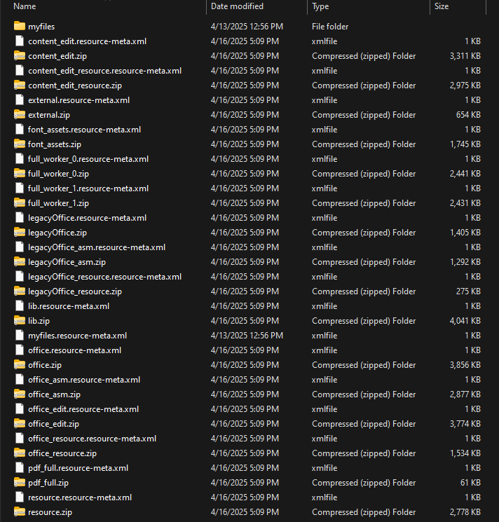
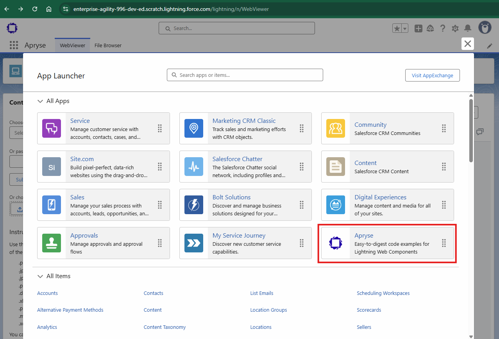
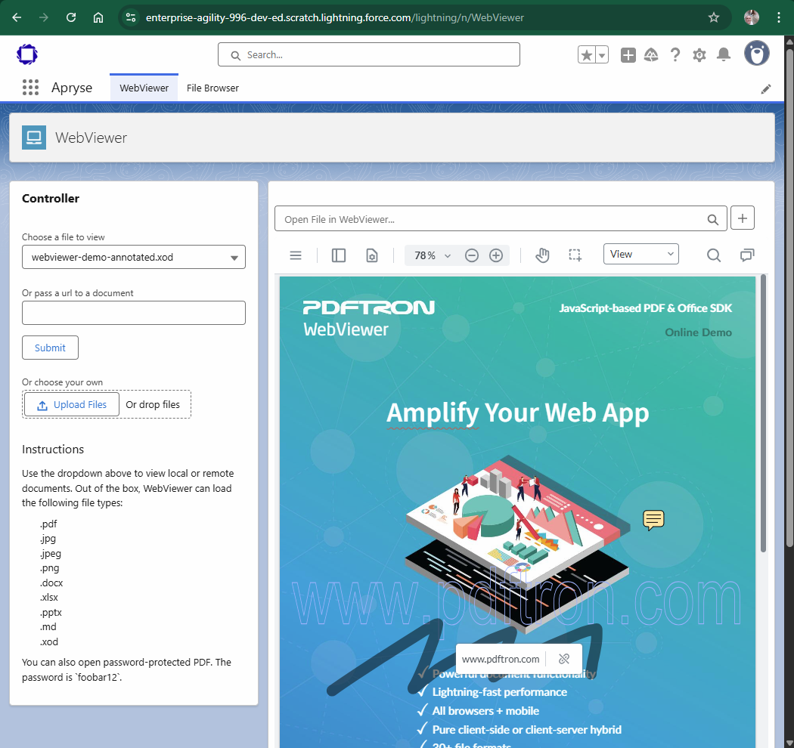

# How to Add an Apryse WebViewer to Salesforce as a Lightning Web Component

[WebViewer](https://docs.apryse.com/web/guides/get-started) is a powerful JavaScript-based PDF Library that is part of the [Apryse SDK](https://apryse.com/). It provides a slick out-of-the-box responsive UI that enables you to view, annotate and manipulate PDFs and other document types inside any web project.

- [WebViewer Documentation](https://docs.apryse.com/web/guides/get-started)
- [WebViewer Demo](https://showcase.apryse.com/)

The quickest way to getting started with WebViewer in Salesforce is to follow the instructions below.

## Get your trial key

A license key is required to run WebViewer. You can obtain a trial key in our [get started guides](https://docs.apryse.com/web/guides/get-started), or by signing-up on our [developer portal](https://dev.apryse.com/).

## Requirements

* [Salesforce CLI](https://trailhead.salesforce.com/en/content/learn/modules/sfdx_app_dev/sfdx_app_dev_setup_dx#Tdxn4tBK-heading6)
* [Node and NPM](https://nodejs.org/en/)

## Installing WebViewer Sample App using Salesforce DX

1. Install Salesforce DX. Enable the Dev Hub in your org or sign up for a Dev Hub trial org and install the Salesforce DX CLI. Follow the instructions in the [Salesforce DX Setup Guide](https://developer.salesforce.com/docs/atlas.en-us.sfdx_setup.meta/sfdx_setup/sfdx_setup_intro.htm?search_text=trial%20hub%20org) or in the [App Development with Salesforce DX](https://trailhead.salesforce.com/modules/sfdx_app_dev) Trailhead module. The steps include:
   * [Enable Dev Hub in you project](https://developer.salesforce.com/docs/atlas.en-us.sfdx_setup.meta/sfdx_setup/sfdx_setup_enable_devhub.htm)
   * [Install Salesforce CLI](https://trailhead.salesforce.com/en/content/learn/modules/sfdx_app_dev/sfdx_app_dev_setup_dx#Tdxn4tBK-heading6)
   * (Optional) [Install Salesforce Extensions for Visual Studio Code](https://marketplace.visualstudio.com/items?itemName=salesforce.salesforcedx-vscode)

2. Clone the `webviewer-salesforce` from Github repo:
```
git clone --depth=1 https://github.com/ApryseSDK/webviewer-samples.git
cd webviewer-samples/webviewer-salesforce
```

**NOTE**: Steps 3 and 4 are needed once - If static resources are already existing under `./force-app/main/default/staticresources` and do not need to upgrade/downgrade to a different version, skip to step 5.

3. Install the Apryse WebViewer SDK
```
npm install
```

`npm install` will download Apryse WebViewer SDK to `webviewer-salesforce/webviewer`.

4. Prepare static files. Use the `optimize` script to generate the Static Resources (.zip and .xml files).
```
npm run optimize
```

Answer the following questions:

```
Optimize: Do you want us to backup your files before optimizing? [y/n]:  y
                                                                                                                                                                                                                   
Optimize: Will you be using WebViewer Server? See https://docs.apryse.com/documentation/web/guides/wv-server/ for more info. [y/n]:  n

Optimize: Will you be converting all your documents to XOD? See https://docs.apryse.com/documentation/web/guides/optimize-lib-folder for more info. [y/n]:  n
                                                                                                                                                                                                                   
Optimize: Do you need client side office support (docx, pptx, xlsx)? [y/n]:  y
                                                                                                                                                                                                                   
Optimize: Do you need client side office support for legacy office files (doc, ppt, xls)? [y/n]:  y
                                                                                                                                                                                                                   
Optimize: Do you need the full PDF API? See https://docs.apryse.com/documentation/web/guides/optimize-lib-folder for more info (most users dont need this option). [y/n]:  y
                                                                                                                                                                                                                   
Optimize: Do you want to use the production version of PDFNet.js? The production version does not have type checking and console messages, but is much smaller than the development version. [y/n]:  n
                                                                                                                                                                                                                   
Optimize: Do you need to use the content editing feature? (This is for editing content on the page in the viewer) [y/n]:  y

Optimize: Do you need to use the office editing feature? (This is for editing docx files in the viewer) [y/n]:  y
                                                                                                                                                                                                                   
Optimize: Do you need to use the spreadsheet editing feature? (This is for editing xlsx files in the viewer) [y/n]:  n
                                                                                                                                                                                                                   
Optimize: Do you need to deploy to Salesforce? See https://docs.apryse.com/documentation/web/guides/optimize-lib-folder for more info (most users dont need this option). [y/n]:  y

==== FILES & FOLDERS TO DELETE ====

C:\Help\Apryse\GitHub\webviewer-samples\webviewer-salesforce\webviewer\lib\core\pdf\lean
C:\Help\Apryse\GitHub\webviewer-samples\webviewer-salesforce\webviewer\lib\core\spreadsheetEditor
C:\Help\Apryse\GitHub\webviewer-samples\webviewer-salesforce\webviewer\lib\ui\webviewer-ui.min.js.map
C:\Help\Apryse\GitHub\webviewer-samples\webviewer-salesforce\webviewer\lib\ui\style.css.map
C:\Help\Apryse\GitHub\webviewer-samples\webviewer-salesforce\webviewer\lib\ui\index-wc.html

===================================
                                                                                                                                                                                                                   
Optimize: The above files will be permanently deleted. Is this okay? (A backup will be created in './lib-backup') [y|n]:  y
```

This optimization process produces zip files of size 5 MB or less, which enables you to safely upload to the Salesforce platform.

Note that in certain circumstances, you may need the full PDF API. For more details on when you may need to enable it, see:

https://docs.apryse.com/web/guides/full-api-overview

The static resources are generated after running above optimization, into `./force-app/main/default/staticresources`.



Every `*.zip` file should have a corresponding `*.resource-meta.xml` file, where the contents of each `.xml` file are identical to the other `.xml` files.

5. If you have a paid license key, you can remove the watermark from rendered
documents by adding the `licenseKey` property value to the `WebViewer` constructor here
[`./force-app/main/default/lwc/pdftronWebViewer/pdftronWebViewer.js`](./force-app/main/default/lwc/pdftronWebViewer/pdftronWebViewer.js#L63).

```
licenseKey: 'YOUR_LICENSE_KEY'
```

6. If you have not already done so, authenticate with your hub org and provide it with an alias (**DevHub** in the command below):
```
sf org login web --set-default-dev-hub --alias DevHub
```

7. Enter your Dev Hub org credentials in the browser that opens. After you log in successfully, you can close the browser. Create a scratch org using the `config/project-scratch-def.json` file, set the **username** as your default, and assign it an alias.
```
sf org create scratch --definition-file config/project-scratch-def.json --set-default --alias my-scratch-org
```

8. Push the app to your scratch org:
```
sf project deploy start --source-dir force-app
```

9. Open the scratch org:
```
sf org open
```

10. Click the app launcher icon  to open the App Launcher, then click Apryse.





The tabs in the Salesforce app registration can be renamed by changing the admin XML file found in `./force-app/main/default/profiles/Admin.profile-meta.xml`. By default the "WebViewer" and "File Browser" tabs are created.

## Implementation Details for Developers

### Communicating with CoreControls from Lightning Web Component
On the Salesforce platform, Lightning Web Component have limits accessing to WebViewer's `iframe` due to [LockerService](https://developer.salesforce.com/blogs/developer-relations/2017/02/lockerservice-lightning-container-third-party-libraries-lightning-components.html) requirements. Lightning Component can use limited communication mechanism between components using [`postMessage`](https://developer.mozilla.org/en-US/docs/Web/API/Window/postMessage). You can find more information about LockerService [here](https://developer.salesforce.com/blogs/developer-relations/2017/02/lockerservice-lightning-container-third-party-libraries-lightning-components.html).

Here is implementation of the `postMessage` mechanism used in our sample github project and you can use this similar approach to communicate with the `iframe`'s `contentWindow`.

Inside `config.js` file, use following:
```js
window.addEventListener('message', receiveMessage, false);

function receiveMessage(event) {
  if (event.isTrusted && typeof event.data === 'object') {
    switch (event.data.type) {
      case 'OPEN_DOCUMENT':
        instance.loadDocument(event.data.file)
        break;
      default:
        break;
    }
  }
}
```
and in the Lightning Web Component send messages with postMessage as following:

```js
import { LightningElement, track, wire } from 'lwc';
import myfilesUrl from '@salesforce/resourceUrl/myfiles';
import libUrl from '@salesforce/resourceUrl/lib';

export default class WebViewer extends LightningElement {

  handleFileSelected(file) {
    this.iframeWindow.postMessage({type: 'OPEN_DOCUMENT', file: file})
  }

  initUI() {
    const myObj = {
      libUrl: libUrl,
      fullAPI: false,
      namespacePrefix: '',
    };

    const viewerElement = this.template.querySelector('div');
    const viewer = new WebViewer({
      path: myObj.libUrl,
      fullAPI: myObj.fullAPI,
      custom: JSON.stringify(myObj),
      initialDoc: 'file.pdf',
      config: myfilesUrl + '/config.js',
    }, viewerElement);

    viewerElement.addEventListener('ready', () => {
      this.iframeWindow = viewerElement.querySelector('iframe').contentWindow
    });
  }
}
```
