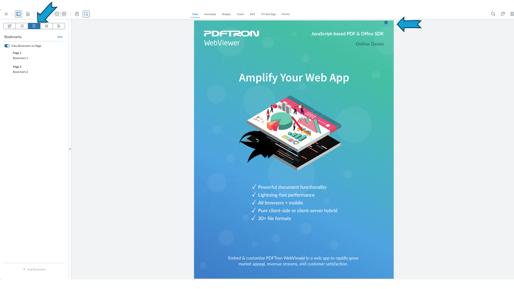

# WebViewer User Bookmarks sample - using files and Node.js backend

[WebViewer](https://docs.apryse.com/web/guides/get-started) is a powerful JavaScript-based PDF Library that is part of the [Apryse SDK](https://apryse.com/). It provides a slick out-of-the-box responsive UI that enables you to view, annotate and manipulate PDFs and other document types inside any web project.

- [WebViewer Documentation](https://docs.apryse.com/web/guides/get-started)
- [WebViewer Demo](https://showcase.apryse.com/)

This is a WebViewer User Bookmarks sample to show how you can save and load user bookmarks through files with a Node.js backend.



## Get your trial key

A license key is required to run WebViewer. You can obtain a trial key in our [get started guides](https://docs.apryse.com/web/guides/get-started), or by signing-up on our [developer portal](https://dev.apryse.com/).

## Initial setup

Before you begin, make sure your development environment includes [Node.js](https://nodejs.org/en/).

## Install

```
git clone --depth=1 https://github.com/ApryseSDK/webviewer-samples.git
cd webviewer-samples/webviewer-user-bookmarks-nodejs
npm cache clean --force
npm install
```

> The install command also runs the `postinstall` scrript to copy the required WebViewer resources to the `client\lib` folder.

## Run

```
npm start
```

## How to use

- Create bookmarks using the `Add Bookmark` button in the bookmarks tab in the left panel
- Edit bookmark names by choosing the option in the context menu popup or by double-clicking on the name
- Delete bookmarks using the option in the context menu popup
- The new multi-select mode also allows for deleting multiple bookmarks at the same time
- Bookmarks are automatically saved using the 'userBookmarksChanged' event

