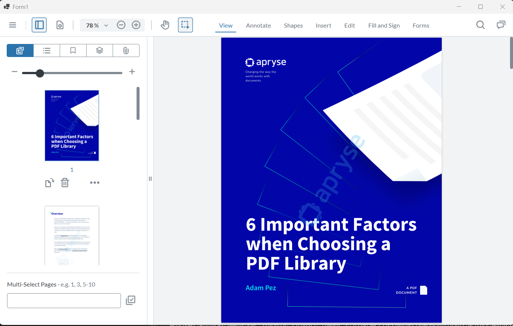

# WebViewer - WinForms sample

[WebViewer](https://docs.apryse.com/web/guides/get-started) is a powerful JavaScript-based PDF Library that is part of the [Apryse SDK](https://apryse.com/). It provides a slick out-of-the-box responsive UI that enables you to view, annotate and manipulate PDFs and other document types inside any web project.

- [WebViewer Documentation](https://docs.apryse.com/web/guides/get-started)
- [WebViewer Demo](https://showcase.apryse.com/)

This sample is designed to show you how to integrate WebViewer into a Winforms project leveraging WebView2.

## Get your trial key

A license key is required to run WebViewer. You can obtain a trial key in our [get started guides](https://docs.apryse.com/web/guides/get-started), or by signing-up on our [developer portal](https://dev.apryse.com/).

## Initial setup
Modify the index.html file in the **WebViewer** folder to include the license key you obtained from our developer portal.

index.html
```js
WebViewer.Iframe({
    path: 'lib', 
    initialDoc: 'WebviewerDemoDoc.pdf',
    //licenseKey: 'LICENSE_KEY'
})
```

## Install
```
git clone --depth=1 https://github.com/ApryseSDK/webviewer-samples.git
cd webviewer-samples/webviewer-winforms
npm install
```

## Run
- Open the webviewer-winforms-sample/webviewer-winforms-sample.sln file in Visual Studio.
- Build the project and then run it.

## Sample Output

